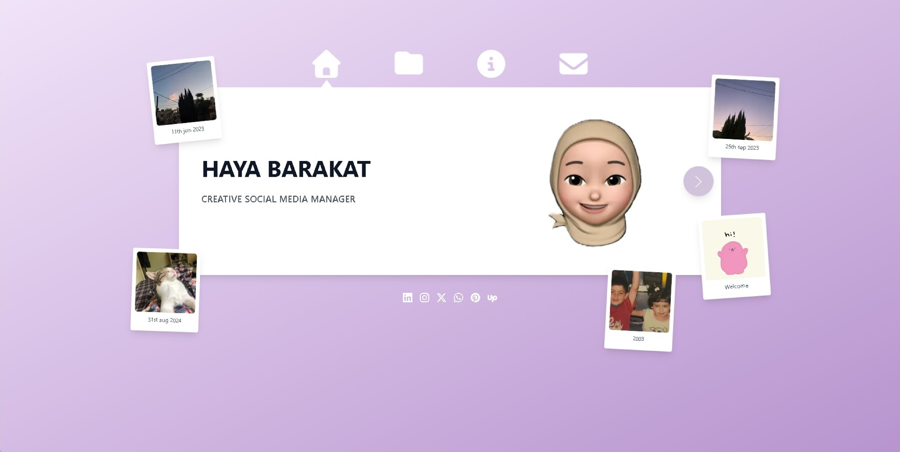
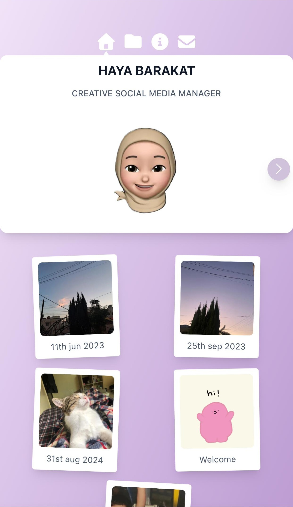

# Haya Barakat Portfolio Website 🔬

A portfolio website showcasing the work of enob art, her services and methods.

## 🚀 Tech Stack
- **Frontend:** React, Next.js and TypeScript.
- **Backend:** Supabase for database and admin authintication, Node.js.
- **Styling:** Tailwind CSS, Shadcn and other custom CSS.
- **Contact:** Resend for the contact form.

## ✨ Features
- Showcasing the personal and professional life of Haya.
- Lists of projects, designs and art. 
- Admin page to allow the owner full control and customization of the website.

## 🧑‍💻 Technical
- Connected admin page, homepage and database for unified edits.
- Single page portfolio website.
- A contact form connected to the owners email using Resend.

## 📸 Main Menu

## 🎥 Video showcase of the project
[▶️ Watch on YouTube](https://www.youtube.com/shorts/alZEfqHy5Ms)

## 🔗 Check the live website
👉 [Haya's Portfolio](https://haya.hiyume.games)